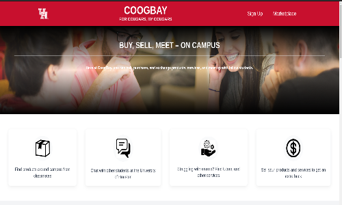
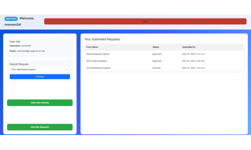

# 🎱 Naim Momin

**`Cloud-savvy Web Dev learning AI`**

Naim Momin is a versatile software developer with a strong foundation in full-stack engineering, cloud deployment, and backend architecture — now exploring AI systems and LLM-native infrastructure. From building scalable logistics tools in ASP.NET to deploying full-stack platforms like CougBay with React, Prisma, and Stripe on Azure, he brings deep experience in systems thinking and clean, efficient code. His growing interest lies in agent-based architectures (A2A) and model orchestration protocols (like MCP), where he aims to apply his engineering expertise to intelligent, distributed systems.

#

### 🧰 Languages and Tools

 

          

### 🚀 Featured Projects

Here are some of my crafty projects that I built with a team of Computer Science nerds.

---

#### 🛍️ [CougBay](https://github.com/alakram01/UH_Market_Place)  
*A Marketplace where University of Houston students can buy and sell products and services.*  
**Tech Stack:** React, TailwindCSS, Supabase  

---

#### 📄 [Forms Request Service](https://github.com/alijavaidistar/WhiteRock)  
*A web app that digitizes UH form requests—like withdrawals, VA benefits, and special petitions—making submission and tracking easier for students.*  
**Tech Stack:** Django, SQLite3, HTML/CSS  

---

#### 🌐 [Ismaili Professional Network](https://ipnonline.net/)  
*A professional networking platform where I built scalable, responsive front-end interfaces using AngularJS and Tailwind CSS.*  
**Tech Stack:** AngularJS, TypeScript, TailwindCSS  

---

<!--
**Mominnaim/Mominnaim** is a ✨ _special_ ✨ repository because its `README.md` (this file) appears on your GitHub profile.

Here are some ideas to get you started:

- 🔭 I’m currently working on ...
- 🌱 I’m currently learning ...
- 👯 I’m looking to collaborate on ...
- 🤔 I’m looking for help with ...
- 💬 Ask me about ...
- 📫 How to reach me: ...
- 😄 Pronouns: ...
- ⚡ Fun fact: ...
-->
